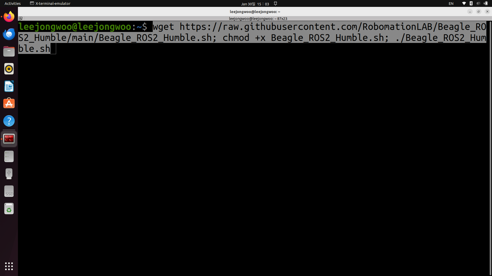

## ROS2-Humble-full install


Ubuntu 22.04 LTS버전을 권장합니다.

아래 코드를 터미널에 입력하면 ROS2_Humble_Hawksbill fullversion과 ROS2 환경에서 Beagle을 동작시키기 위한 패키지들이 설치됩니다.
터미널은 Ctrl+Alt+T를 누르면 실행됩니다.


Recommend Ubuntu 22.04 LTS version.

Entering the code below into the terminal will install ROS2_Humble_Hawksbill full version and the packages required to operate Beagle in the ROS2 environment. 
You can open the terminal by pressing Ctrl+Alt+T


```javascript
wget https://raw.githubusercontent.com/RobomationLAB/Beagle_ROS2_Humble/main/Beagle_ROS2_Humble.sh; chmod +x Beagle_ROS2_Humble.sh; ./Beagle_ROS2_Humble.sh
```

### 예시



www.robomation.com
